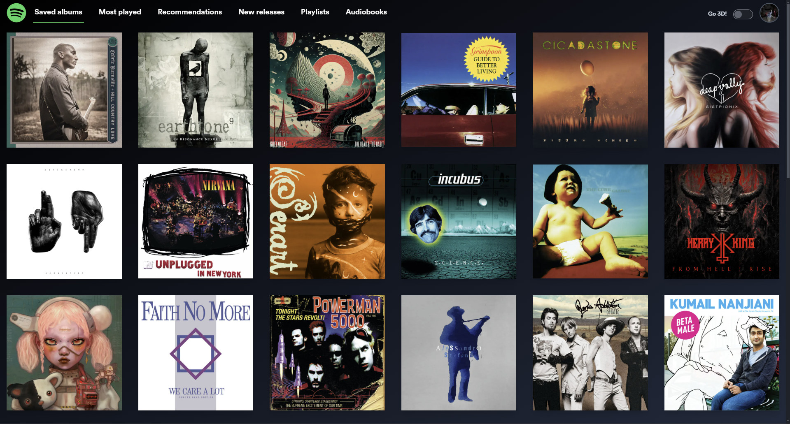
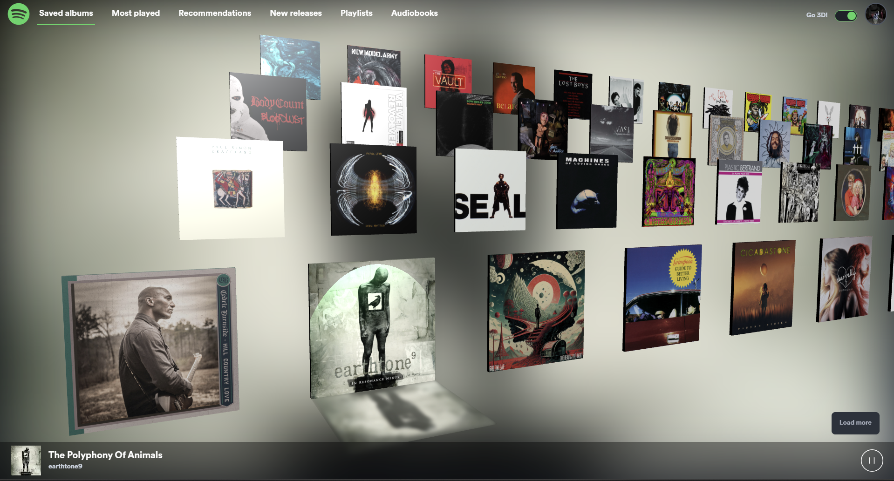

# Spotify Get Rect





This is a [Next.js](https://nextjs.org/) project bootstrapped with

Currently deployed at eighthsamurai.com.

Navigate your library and click on album/audiobook/playlist covers to start playback, which can be in the browser or on another device if you already have Spotify active there.

Toggle 3D view to see a different visualisation of your library.

## Getting Started

First, run the development server:

```bash
npm run dev
# or
yarn dev
# or
pnpm dev
# or
bun dev
```

Open [http://localhost:3000](http://localhost:3000) with your browser to see the result.

## Purpose

This was a quick training project over a couple of weeks to learn and experiment with a few frontend frameworks and technologies and a little bit of DevOps too. Specifically and in no particular order:

- Next JS v14
- Tailwind CSS
- Daisy UI
- Babylon JS
- CD/CI using vercel
- 3rd party authentication (via Spotify auth tokens)

I'm going to continue tweaking this project as there's lots to improve!

## Architecture

The main purpose of this app was to actually use Next JS and Tailwind CSS rather than just watching tutorials about them. Some of the other architectural decisions then flowed from that.

The app's component distribution architecture is a little bit artificial in that I started with the aim of using as many server side components as possible. As the project progressed it became less and less feasible to do that (see open issues), so over time this will become more fully client side again.

The app uses the Spotify web API to fetch and play with a user's Spotify library. Authentication is done via an auth token. If there isn't a valid auth token, the app loads a page outside of the Next JS framework that uses Spotify API credentials to fetch an auth token, which is then stored in a cookie. We also use the Spotify web playback SDK to allow user's to play tracks directly in the browser.

Daisy UI was chosen for the component library because it integrates so well with Tailwind CSS.

I've wanted to experiment with browser 3D rendering for a long time and Babylon JS is an excellent library, that is pretty easy to integrate into a React application.

## Open Issues

- The SDK doesn't work on mobile browsers. So for mobiles, we can only use the app for controlling play on other active devices.
